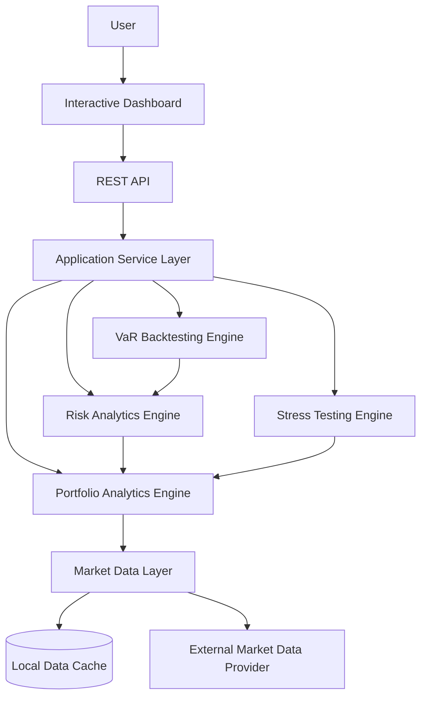

<div align="center">

# Market Risk and Stress Testing Platform

**An end-to-end platform for portfolio market risk analysis, model validation and stress testing.**


[](https://github.com/TEU-USERNAME/market-risk-stress-testing-platform/actions/workflows/ci.yml)


</div>

---

## Overview

The **Market Risk and Stress Testing Platform** is a professional portfolio project designed to reproduce selected components of a real-world financial risk analytics workflow.

Rather than attempting to predict the future price or direction of financial assets, the platform focuses on measuring, validating and communicating the market risk associated with an investment portfolio.

The completed application will allow users to construct multi-asset portfolios, analyse historical performance, estimate potential losses using different Value at Risk methodologies, calculate Expected Shortfall, validate risk estimates through statistical backtesting and evaluate portfolio sensitivity under adverse market scenarios.

The project combines quantitative finance, statistical modelling and modern software engineering practices in a reproducible, modular and product-oriented application.

---

## Motivation

Many educational finance projects focus on asset-price prediction or implement isolated calculations inside notebooks.

This project takes a different approach by integrating the principal stages of a market risk workflow into a single system:

1. Historical market-data acquisition
2. Portfolio construction and validation
3. Performance and risk measurement
4. Value at Risk and Expected Shortfall estimation
5. Statistical backtesting
6. Stress testing
7. REST API exposure
8. Interactive visualisation
9. Automated testing and reproducible deployment

The objective is not only to implement financial methodologies, but also to demonstrate how they can be organised into a maintainable software product.

---

## Planned Capabilities

### Portfolio Analytics

* Multi-asset portfolio construction
* Portfolio-weight validation
* Simple and logarithmic returns
* Cumulative and annualised returns
* Annualised volatility
* Sharpe ratio
* Maximum drawdown
* Rolling volatility
* Asset correlation analysis

### Market Risk

* Historical Simulation Value at Risk
* Parametric Variance-Covariance Value at Risk
* Monte Carlo Value at Risk
* Historical Expected Shortfall
* Parametric Expected Shortfall
* Percentage and monetary risk estimates
* Configurable confidence levels and risk horizons

### Model Validation

* Rolling VaR estimation
* VaR exception identification
* Expected and observed exception rates
* Kupiec Proportion of Failures test
* Backtesting visualisations

### Stress Testing

* Broad equity market decline
* Technology-sector decline
* Banking-sector shock
* Cryptocurrency market decline
* Cross-asset risk-off scenario
* Portfolio-level stress losses
* Asset-level loss contributions

### Application and Engineering

* Modular Python analytical package
* Documented REST API using FastAPI
* Interactive dashboard using Streamlit
* Automated unit and integration tests
* Static type checking
* Automated formatting and linting
* Continuous integration
* Containerised execution
* Technical and methodological documentation

---

## Current Status

The project is currently in the initial development phase.

### Version `v0.1` — Planning and Repository Setup

Completed:

* Project specification
* Initial roadmap
* System architecture
* Repository structure
* Python project configuration
* Development dependency configuration
* Testing, formatting, linting and type-checking configuration

In progress:

* Initial continuous integration workflow

The analytical functionality will be implemented incrementally according to the [project roadmap](docs/roadmap.md).

---

## System Architecture

The platform follows a layered architecture that separates market-data acquisition, portfolio analytics, risk estimation, validation, stress testing and application interfaces.



The analytical package will remain independent of the dashboard and API, allowing the financial calculations to be tested and reused separately.

See the complete [architecture documentation](docs/architecture.md).

---

## Technology Stack

### Current Development Tooling

| Component                          | Technology       |
| ---------------------------------- | ---------------- |
| Programming language               | Python 3.12      |
| Package and environment management | uv               |
| Build backend                      | Hatchling        |
| Testing                            | Pytest           |
| Test coverage                      | pytest-cov       |
| Formatting and linting             | Ruff             |
| Static type checking               | MyPy             |
| Project configuration              | `pyproject.toml` |

### Planned Application Stack

| Component              | Planned Technology    |
| ---------------------- | --------------------- |
| Numerical computation  | NumPy                 |
| Data manipulation      | pandas                |
| Statistical methods    | SciPy and Statsmodels |
| REST API               | FastAPI               |
| Interactive dashboard  | Streamlit             |
| Data visualisation     | Plotly                |
| Containerisation       | Docker                |
| Continuous integration | GitHub Actions        |

Dependencies will be added incrementally when they become necessary for implemented functionality.

---

## Repository Structure

The project currently uses a minimal `src` layout:

```text
market-risk-stress-testing-platform/
├── docs/
│   ├── architecture.md
│   ├── project_specification.md
│   ├── project_structure.md
│   └── roadmap.md
├── src/
│   └── market_risk/
│       └── __init__.py
├── tests/
│   └── test_package.py
├── .gitignore
├── .python-version
├── LICENSE
├── pyproject.toml
├── README.md
└── uv.lock
```

Additional modules and directories will be created when their corresponding development phases begin.

See the planned [repository structure](docs/project_structure.md).

---

## Getting Started

### Prerequisites

The project requires:

* Python 3.12
* Git
* uv

### Clone the Repository

```bash
git clone https://github.com/<martim-q-pfelix23>/market-risk-stress-testing-platform.git
cd market-risk-stress-testing-platform
```

### Install the Environment

```bash
uv sync
```

This command creates the local virtual environment and installs the exact dependency versions recorded in `uv.lock`.

### Verify the Installation

```bash
uv run python --version
uv run pytest
```

The Python version should be compatible with Python 3.12 and all tests should pass.

---

## Development Commands

All commands should be executed from the repository root.

### Run Tests

```bash
uv run pytest
```

### Run Linting

```bash
uv run ruff check .
```

### Check Formatting

```bash
uv run ruff format --check .
```

### Apply Formatting

```bash
uv run ruff format .
```

### Run Static Type Checking

```bash
uv run mypy src
```

### Run All Current Quality Checks

```bash
uv run ruff check .
uv run ruff format --check .
uv run mypy src
uv run pytest
```

---

## Documentation

Detailed project documentation is available in the `docs/` directory:

* [Project Specification](docs/project_specification.md)
* [Development Roadmap](docs/roadmap.md)
* [System Architecture](docs/architecture.md)
* [Repository Structure](docs/project_structure.md)

Methodological documentation will be added as each financial component is implemented.

---

## Project Scope

The project is designed as a technical demonstration of a modern market risk analytics system.

Version `v1.0` will not include:

* Asset-price prediction
* Automated trading
* Personalised investment recommendations
* Broker or order-execution integration
* Real-time or intraday market data
* Credit risk modelling
* Fraud detection
* Derivative pricing
* Regulatory capital calculations
* Production deployment for regulated institutions

These exclusions preserve a realistic development scope and maintain a clear distinction between market risk analytics and investment decision-making.

---

## Roadmap

The project is divided into incremental versions:

| Version | Development Phase                                    |
| ------- | ---------------------------------------------------- |
| `v0.1`  | Planning and repository setup                        |
| `v0.2`  | Market data layer                                    |
| `v0.3`  | Portfolio analytics engine                           |
| `v0.4`  | Risk metrics                                         |
| `v0.5`  | Value at Risk and Expected Shortfall                 |
| `v0.6`  | VaR backtesting                                      |
| `v0.7`  | Stress testing                                       |
| `v0.8`  | REST API and interactive dashboard                   |
| `v0.9`  | Quality assurance, Docker and continuous integration |
| `v1.0`  | Documentation and public release                     |

Detailed deliverables and completion criteria are available in the [project roadmap](docs/roadmap.md).

---

## Skills Demonstrated

This project is intended to demonstrate practical competencies in:

* Quantitative finance
* Financial risk management
* Statistical modelling
* Financial data analysis
* Python software development
* Modular software architecture
* REST API development
* Interactive data visualisation
* Automated testing
* Static type checking
* Continuous integration
* Containerisation
* Reproducible analytical pipelines
* Technical documentation

---

## License

This project is distributed under the [MIT License](LICENSE).

---

## Disclaimer

This project is developed exclusively for educational and portfolio purposes.

The calculations, simulations and outputs produced by the platform do not constitute financial advice, investment recommendations or guarantees regarding future financial performance.
