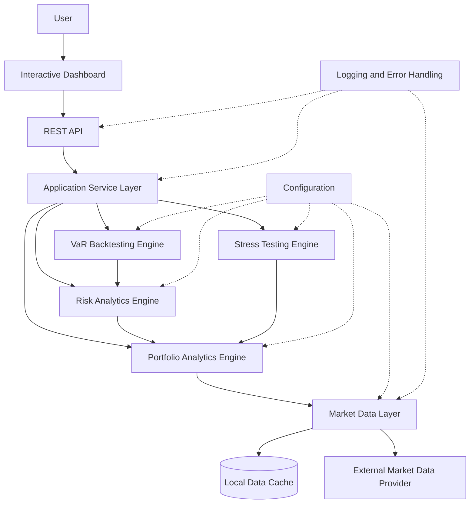
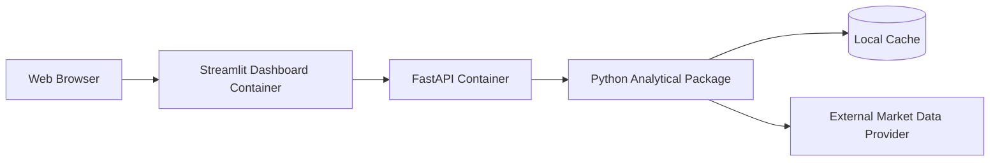

# System Architecture

## 1. Overview

This document describes the planned architecture of the Market Risk and Stress Testing Platform.

The system follows a modular layered architecture that separates:

* external market-data acquisition;
* portfolio construction and performance analytics;
* market-risk estimation;
* model validation and stress testing;
* application interfaces;
* configuration, logging and validation concerns.

This separation prevents financial calculations from being coupled to the REST API or interactive dashboard and allows the analytical engine to be tested independently.

---

## 2. High-Level Architecture

---

## 3. Architectural Layers

### 3.1 Presentation Layer

The presentation layer contains the interactive dashboard.

Its responsibilities are to:

* collect portfolio inputs;
* request analytical operations through the REST API;
* present metrics and visualisations;
* display validation errors clearly;
* avoid implementing financial calculations directly.

The initial dashboard will be implemented using Streamlit.

---

### 3.2 API Layer

The API layer exposes the platform capabilities through documented HTTP endpoints.

Its responsibilities are to:

* validate request and response schemas;
* route requests to the application service layer;
* convert domain errors into appropriate HTTP responses;
* expose OpenAPI documentation;
* provide a stable interface independent of the dashboard.

The API will be implemented using FastAPI.

---

### 3.3 Application Service Layer

The application service layer coordinates the analytical modules.

Its responsibilities are to:

* orchestrate multi-step use cases;
* retrieve the required data;
* construct portfolios;
* invoke performance, risk, backtesting or stress-testing operations;
* combine results into API response models.

This layer shall coordinate calculations but shall not contain the underlying mathematical implementations.

---

### 3.4 Market Data Layer

The market data layer isolates the platform from the external data provider.

Its responsibilities are to:

* retrieve historical adjusted prices;
* validate requested asset identifiers and date ranges;
* align market time series;
* identify missing or insufficient observations;
* standardise external data into an internal format;
* manage local caching where appropriate.

The remainder of the application must not depend directly on provider-specific response formats.

---

### 3.5 Portfolio Analytics Engine

The portfolio analytics engine contains the portfolio domain logic.

Its responsibilities are to:

* validate portfolio weights;
* calculate asset returns;
* aggregate portfolio returns;
* construct the portfolio value time series;
* calculate performance measures;
* calculate drawdowns and correlations.

This engine provides the return series and portfolio information consumed by the risk, backtesting and stress-testing components.

---

### 3.6 Risk Analytics Engine

The risk analytics engine implements portfolio loss-estimation methodologies.

Its responsibilities are to calculate:

* Historical Simulation VaR;
* Parametric VaR;
* Monte Carlo VaR;
* Expected Shortfall;
* percentage and monetary risk values.

Risk calculations shall support configurable confidence levels, horizons and simulation parameters.

---

### 3.7 VaR Backtesting Engine

The backtesting engine evaluates the statistical adequacy of VaR estimates.

Its responsibilities are to:

* generate rolling VaR forecasts;
* compare forecasts with realised returns;
* detect VaR exceptions;
* calculate expected and observed exception rates;
* perform the Kupiec Proportion of Failures test;
* provide structured results for visualisation.

---

### 3.8 Stress Testing Engine

The stress-testing engine applies deterministic adverse scenarios to portfolio positions.

Its responsibilities are to:

* validate scenario definitions;
* apply shocks to assets or asset categories;
* estimate the resulting portfolio loss;
* calculate asset-level loss contributions;
* compare multiple stress scenarios.

Stress scenarios shall remain explicit, reproducible and documented.

---

## 4. Cross-Cutting Components

### Configuration

Centralised configuration shall define values such as:

* default confidence levels;
* annualisation factor;
* risk horizon;
* Monte Carlo simulation count;
* random seed;
* data-provider settings;
* cache settings.

Configuration values shall not be duplicated across modules.

### Validation

Input validation shall be applied at both:

* the API boundary, for request-format validation;
* the domain layer, for financial and analytical constraints.

### Logging

Structured logging shall record:

* market-data requests;
* analytical operations;
* validation failures;
* unexpected errors;
* application lifecycle events.

Sensitive environment values shall not be written to logs.

### Error Handling

The platform shall use explicit domain exceptions for conditions such as:

* unavailable assets;
* invalid portfolio weights;
* insufficient historical data;
* unsupported confidence levels;
* invalid stress scenarios.

---

## 5. Data Flow

A typical portfolio-risk request follows these steps:

1. The user defines the portfolio through the dashboard.
2. The dashboard sends the request to the REST API.
3. The API validates the request schema.
4. The application service requests historical data from the data layer.
5. The data layer retrieves or loads the required observations.
6. The portfolio engine validates the weights and calculates portfolio returns.
7. The requested analytical engine performs the calculation.
8. The application service combines the results.
9. The API returns a structured response.
10. The dashboard presents the results and visualisations.

---

## 6. Architectural Principles

The architecture follows these principles:

* **Separation of concerns:** interfaces, orchestration, data access and financial calculations remain independent.
* **Dependency isolation:** external data-provider logic is restricted to the data layer.
* **Testability:** analytical modules can be tested without running the dashboard or API.
* **Reproducibility:** stochastic calculations accept explicit random seeds.
* **Replaceability:** dashboard and data-provider implementations can be replaced without rewriting the analytical core.
* **Scope control:** the architecture supports the mandatory summer release without requiring distributed or cloud-native infrastructure.

---

## 7. Deployment Model

For version `v1.0`, the platform will use a containerised local deployment consisting of:

The deployment is intended for demonstration and educational use. High availability, horizontal scaling and regulated production deployment are outside the scope of version `v1.0`.
